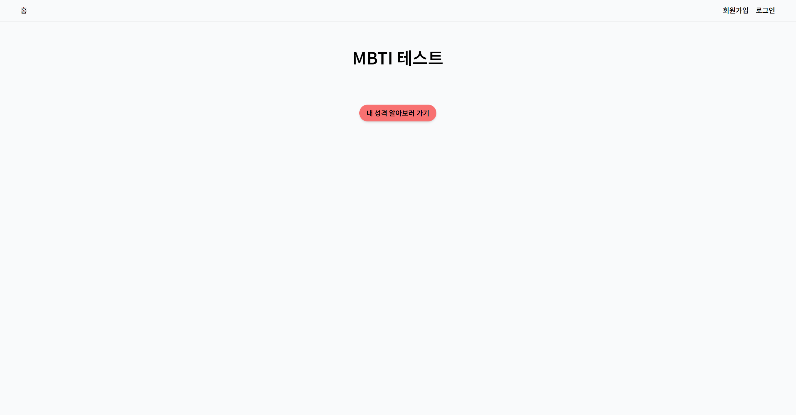
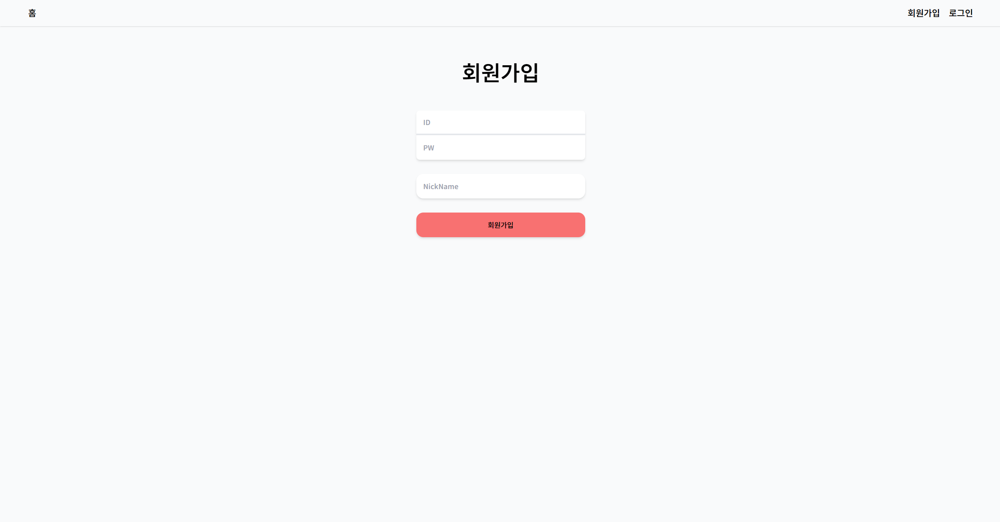
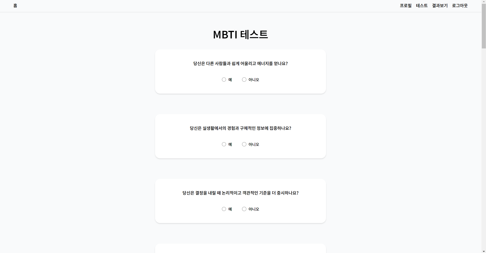
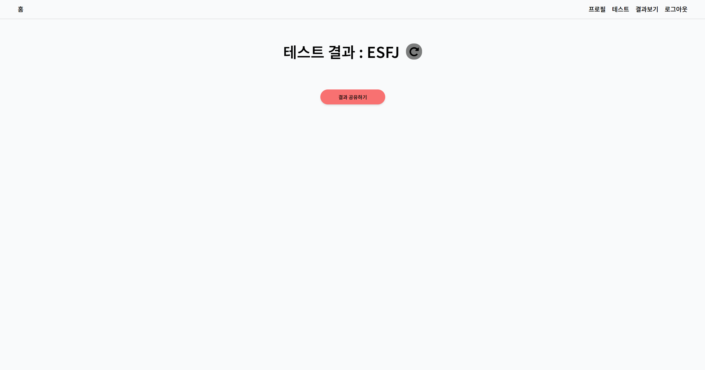
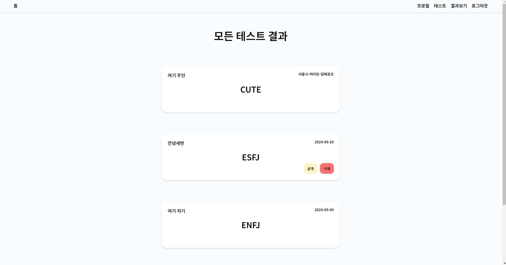
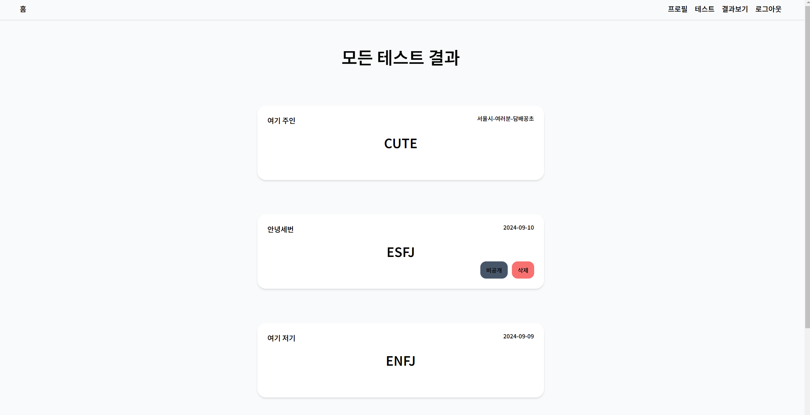
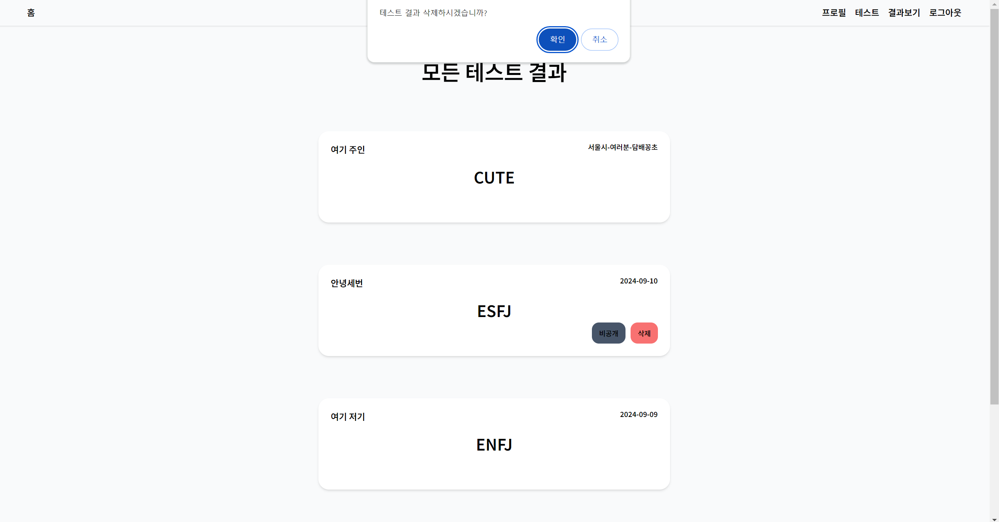

# Tiramisucake (T라 미숙해)

#### 리액트 심화 개인과제

T라 미숙해는 MBTI 성격 유형 테스트 서비스 제공하는 웹 애플리케이션입니다. 사용자는 테스트를 통해 자신의 MBTI 성격 유형을 확인할 수 있으며, 결과를 다른 사용자들과 공유할 수 있습니다. 로그인을 통해 사용자 고유의 프로필을 관리할 수 있습니다.  

#### 프로젝트 구조

1. **홈페이지** 

    - 로그인하지 않아도 접근할 수 있습니다. 성격 검사를 시작할 수 있는 버튼이 제공됩니다.

2. **로그인 / 회원가입 페이지** 

    - 테스트를 진행하거나 프로필을 관리하기 위해서는 로그인 또는 회원가입이 필요합니다.

3. **테스트 페이지** 

    - MBTI 성격 검사를 진행할 수 있는 페이지입니다. 질문에 답변한 후 제출하면 검사 결과 컴포넌트가 조건 렌더링됩니다. 이 컴포넌트에서 '다시하기' 버튼으로 테스트를 다시 진행하거나 '결과 공유' 버튼으로 결과를 공유할 수 있습니다.

4. **테스트 결과 페이지** 

    - 테스트 결과를 확인할 수 있으며, 결과를 공개 또는 비공개로 설정할 수 있습니다. 또한, 다른 사용자의 공개된 테스트 결과를 볼 수 있습니다.

5. **프로필 변경 페이지** 

    - 사용자는 자신의 닉네임을 변경할 수 있습니다.  

#### 실행 방법

1.  **홈페이지** 

    -   "내 성격 알아보기" 버튼을 클릭하여 MBTI 테스트를 시작합니다. 테스트를 진행하려면 로그인이 필요합니다. 로그인하지 않은 경우, 로그인 페이지로 이동하며, 회원가입을 통해 계정을 생성할 수 있습니다.

2.  **테스트 페이지** 

    -   MBTI 질문에 답변하고 제출 후, 성격 유형 결과를 확인합니다. 결과 페이지에서 '다시하기' 또는 '결과 공유' 버튼을 사용할 수 있습니다.

3.  **테스트 결과 페이지** 

    -   자신의 테스트 결과를 공개 또는 비공개로 설정하거나 삭제할 수 있습니다. 다른 사용자의 공개된 결과도 조회할 수 있습니다.

4.  **프로필 변경 페이지** 

    -   사용자의 닉네임을 수정할 수 있습니다.  

#### 주요 기능

-   **기능 요약** 

    -   **Create**: `post` 회원가입 및 로그인 & 테스트 결과 저장 
    -   **Read**: `get` 테스트 결과 출력 & 공개된 테스트 결과 조회 
    -   **Update**: `put` 프로필 닉네임 변경 & 테스트 결과 공개/비공개 설정 
    -   **Delete**: `filter` 테스트 결과 삭제 

-   **페이지 이동** 

    -   `react-router-dom` - `navigate` 페이지 간 이동 

-   **상태 관리** 
    -   `Zustand` 사용자 로그인 상태 및 프로필 변경 관리

#### 개발 환경

